# Explore-Skills_Azure
<h1>Explore Skill platform </h1>
 
"Unleash Your Potential: Explore Skills, Ignite Success".

<h3>Project Details:</h3>
Project Demo URL:
<a href="https://portal.azure.com/#home">Project Demo URL : https://portal.azure.com/#home</a>   
Youtube Video URL :    
GIT HUB  URL:
<a href="https://github.com/alekyagummala/Explore-Skills_Azure">GitHub Repository URL : https://github.com/alekyagummala/Explore-Skills_Azure</a>    
Industry: LIFESTYLE(Explore the Skills) 

<h3>Team & Responsibilities:</h3> 
1.Y. Rajesh Reddy:    Developer of the project. Created the website and managed the website using HTML, CSS, and Javascript. 
2. Gummala Alekya:    Developed the project. Data collection, Done the entire process. 
3. Bonagiri Vinod:    Development, deployment, Static website in Azure portal. 
4. kurma Manoj:       Documentation and content collection of the project. 

<h3>AZURE CORE SERVICES USED:</h3>
Azure Storage
Azure containers
Azure backup
Azure ai
Azure language
Azure RBAC which is a role-based access service

<h3>AZURE AI SERVICES USED:</h3>
Azure Bot Service
Manage Identity
Azure AI Service
Search Service

<h3>PROBLEM STATEMENT:</h3>

"In the world of skill development and personal growth, individuals often face challenges in finding a platform that caters to their diverse talents". Current learning platforms lack curated and engaging learning paths, interactive assessments, and personalized feedback, making it difficult for users to master skills systematically. The absence of immersive hands-on experiences and adaptive challenges makes it hard for learners to apply their knowledge in real-world situations.

Additionally, there's a lack of a centralized hub for various skills like dancing, singing, painting, and stand-up comedy, making it challenging for users to explore and navigate their creativity efficiently. This fragmented learning environment creates a disconnect between users and their skill development goals, leading to frustration and hindering their full potential.

Recognizing these issues, there's a need for an innovative skill development platform. The envisioned solution should offer meticulously curated learning paths, interactive skill assessments, hands-on experiences, and adaptive challenges tailored to individual proficiency levels. The goal is to create a user-centric platform that simplifies the learning journey, empowering users to unlock their full potential and turn their creative aspirations into tangible successes in the ever-evolving world of skill exploration.

<h3>PROJECT DESCRIPTION:</h3>

"The Explore Skills website project is all about creating a new and exciting online learning platform". The main goal is to make a space that is dynamic and focused on users, helping people improve their skills in different areas. We know that learning online can be tricky, so our website will have carefully planned learning paths, interactive skill tests, and practical learning activities.

The website will be easy to use, with a clean design that makes learning enjoyable. Whether you're into dancing, singing, painting, or stand-up comedy, our website will be a one-stop shop for exploring and being creative. Each skill category will have lots of information to help users choose the right learning path.

To make the experience even better, our website will have advanced tools to evaluate skills, providing personalized feedback and insights on growth. Challenges will be adjusted to each person's skill level, making learning personalized and effective. This approach not only makes learning easier but also motivates users to reach their full potential, turning their creative dreams into real achievements in the exciting world of skill development.

<h2>AZURE CORE AZURE SERVICES:</h2>

<h3>Azure Storage Account:</h3>
Azure Storage Account is a cloud-based storage solution provided by Microsoft Azure, a leading cloud computing platform. It serves as a scalable and secure repository for various types of data, offering a range of storage services to meet diverse application needs.

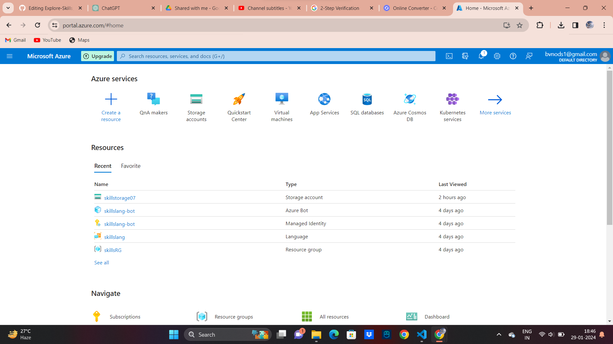

<h3>Azure Blob Storage:</h3>

Azure Blob Storage is a cloud-based object storage service in Microsoft Azure, designed for storing and managing large amounts of unstructured data, such as documents, images, and videos. It provides scalable and secure storage, supporting different access tiers based on data usage patterns. Blob Storage is commonly used for backup, data archiving, and serving content to web applications.

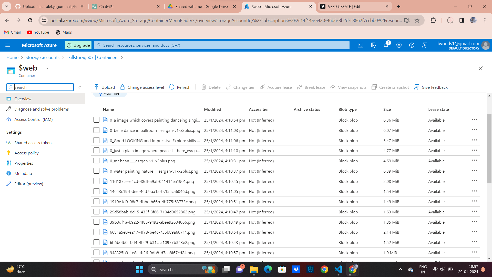

<h3>Azure Backup Service:</h3>

Azure Backup Service is a cloud-based solution provided by Microsoft Azure that enables organizations to back up and protect their data and workloads in the cloud. It offers a reliable and scalable backup solution with features designed to safeguard critical information.

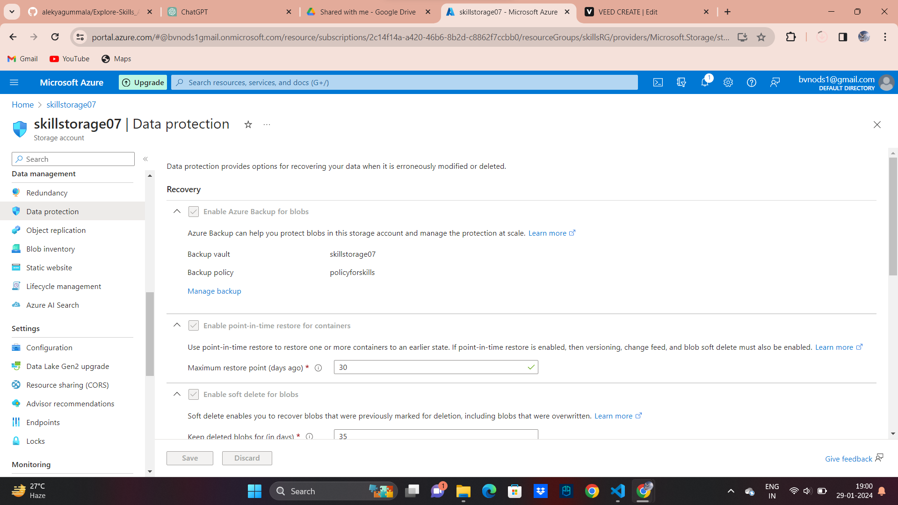

<h3>Azure RBAC which is a role-based access service:</h3>

Azure RBAC, or Role-Based Access Control, is a service provided by Microsoft Azure that helps manage and control access to Azure resources. It is a security model that allows administrators to define who (identity) can do what (actions) on specific resources in Azure. RBAC helps in implementing the principle of least privilege, ensuring that users have only the necessary permissions to perform their tasks and limiting the risk of unauthorized access.

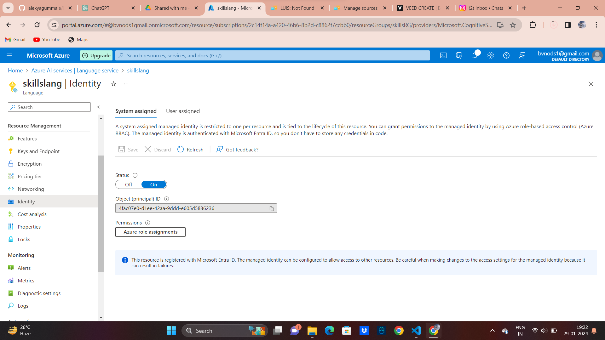
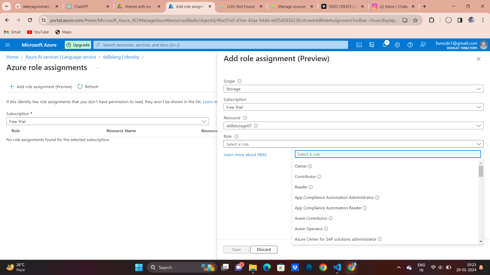

<h2>AZURE AI SERVICES:</h2>

<h3>Azure Bot Service:</h3>

Azure Bot Service is a cloud-based service provided by Microsoft Azure that enables the development, deployment, and management of intelligent bots. Bots created using Azure Bot Service can interact with users across various channels, such as web, mobile, Microsoft Teams, Skype, and more.
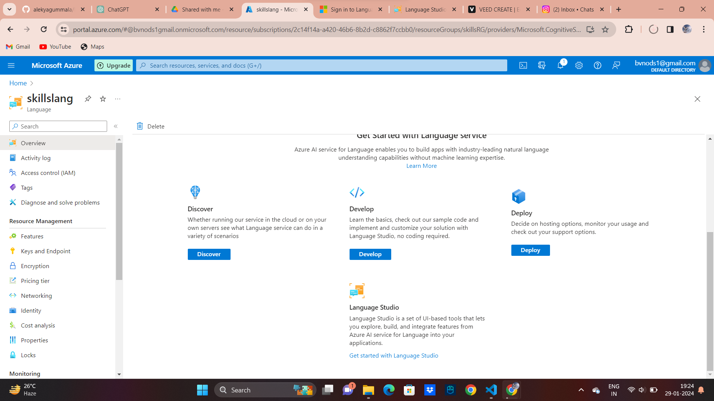
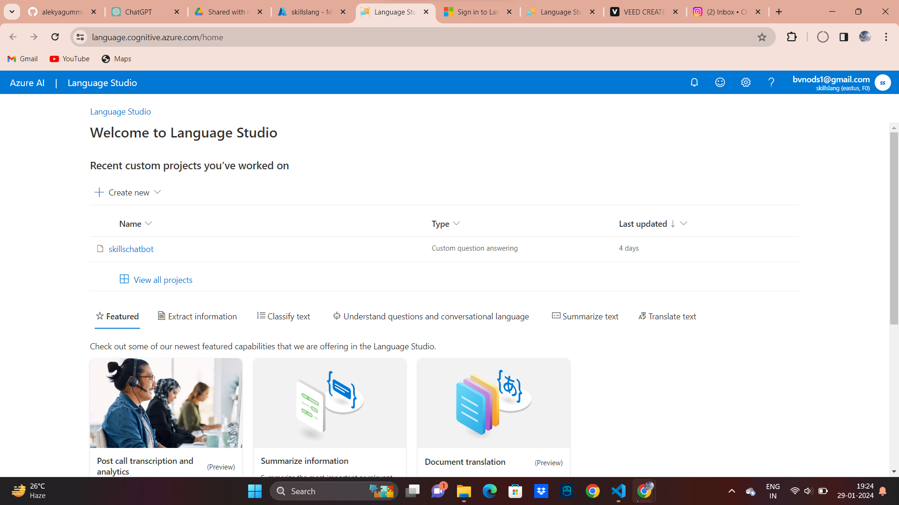
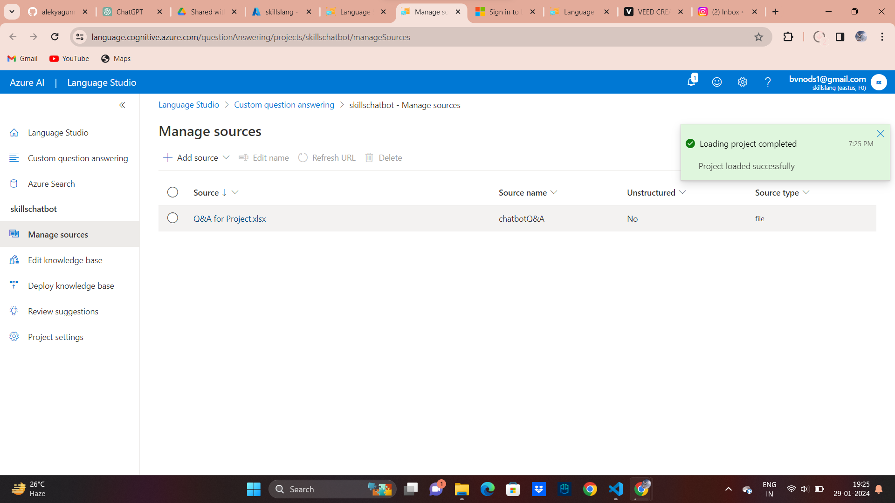
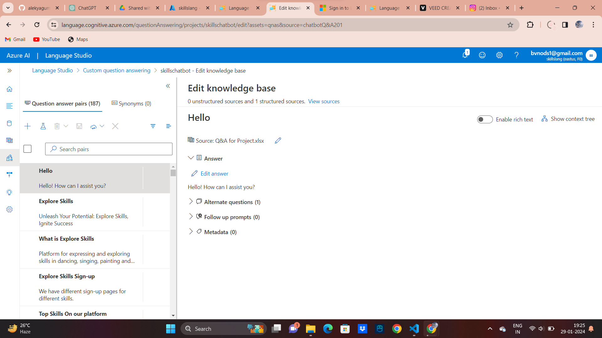
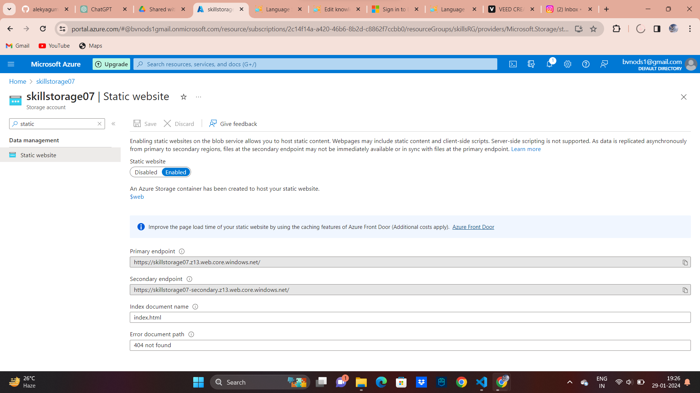
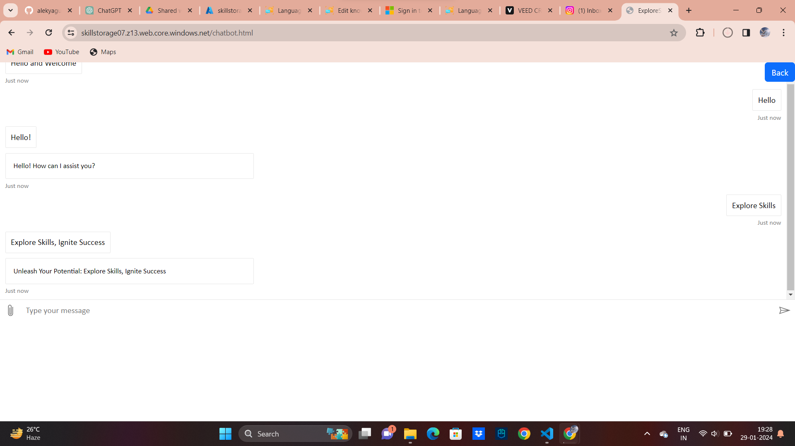
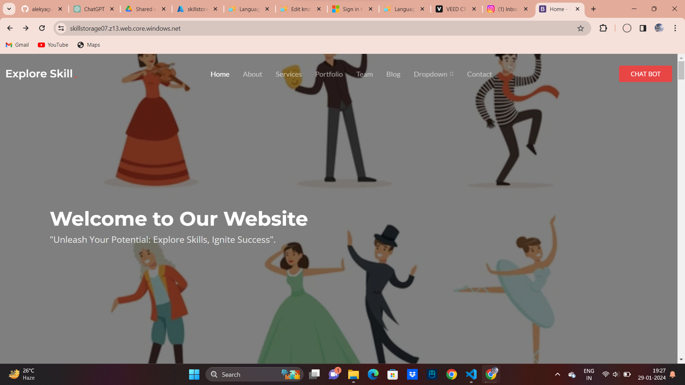

<h3>Manage Identity:</h3>

Azure Managed Identity is a service in Microsoft Azure that enhances the security and ease of access to cloud resources by providing an identity management solution for applications and services.

<h3>Azure AI Service</h3>

Azure AI services encompass a suite of artificial intelligence (AI) offerings provided by Microsoft Azure, designed to empower developers and businesses to integrate AI capabilities into their applications and workflows.

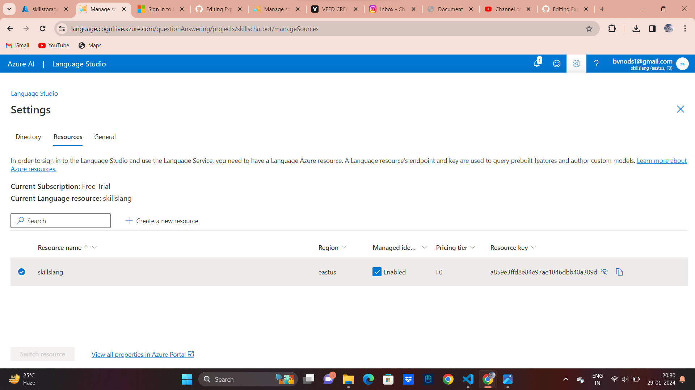

<h3>Search Service:</h3>
Azure Search Service is a fully managed, cloud-based search-as-a-service solution provided by Microsoft Azure. It allows developers to integrate powerful search capabilities into their applications without the need for complex infrastructure or extensive search engine expertise.

	

<h2>FINAL PROJECT STATEMENT </h2>

"EXPLORE SKILLS, IGNITE SUCCESS" stands as a pioneering initiative, set to redefine the online learning experience. Through the seamless integration of cutting-edge technology, user-centric design, and a rich array of features, this project is committed to empowering individuals on their unique skill development journey. Our mission is clear – to establish a modern, adaptive, and efficient ecosystem that not only meets the diverse learning needs of individuals but also cultivates a vibrant community of skill enthusiasts and professionals.

In the ever-evolving landscape of skill exploration, our platform aims to be the catalyst for transformation, bridging the gap between creative aspirations and tangible achievements. "EXPLORE SKILLS, IGNITE SUCCESS" is more than just a learning platform; it is a dynamic force poised to inspire and guide individuals towards unlocking their full potential. Join us on this journey, where innovation meets education, and together, we ignite success in the world of skill exploration.

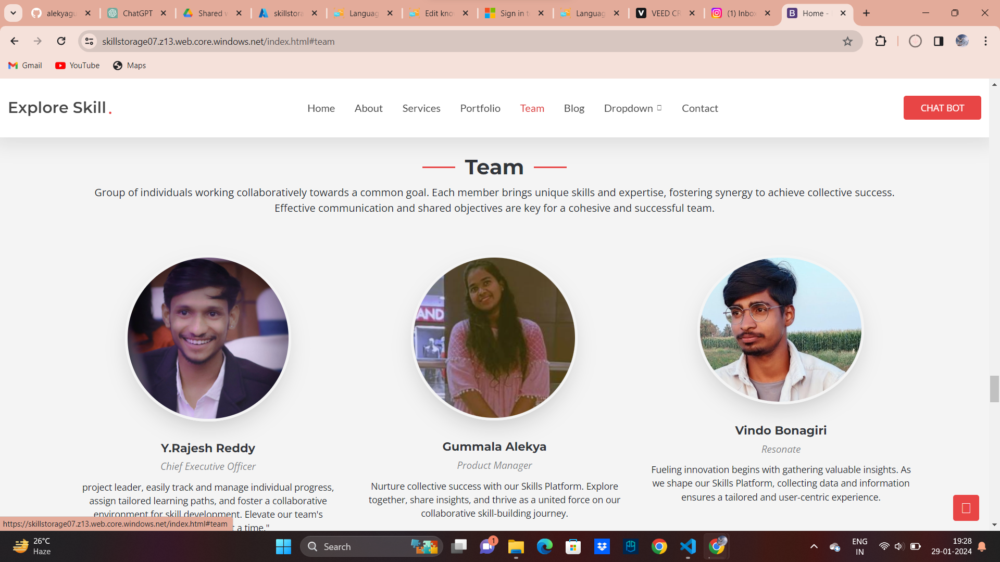
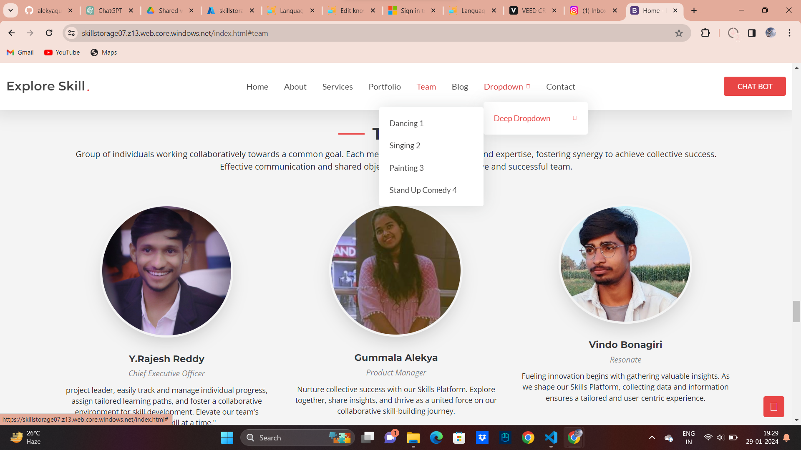
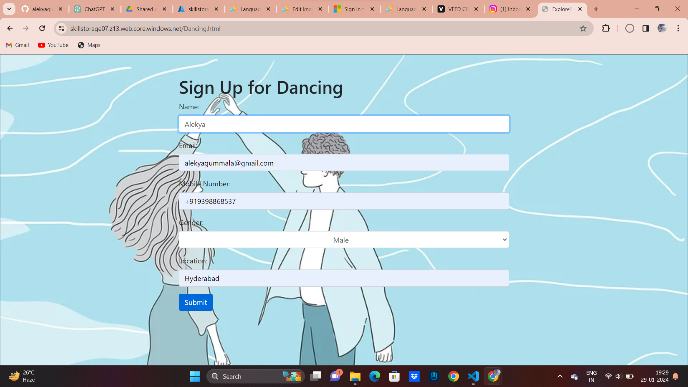
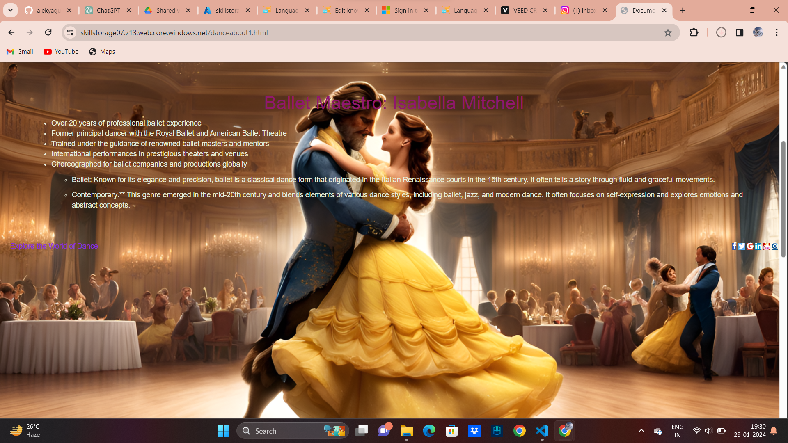
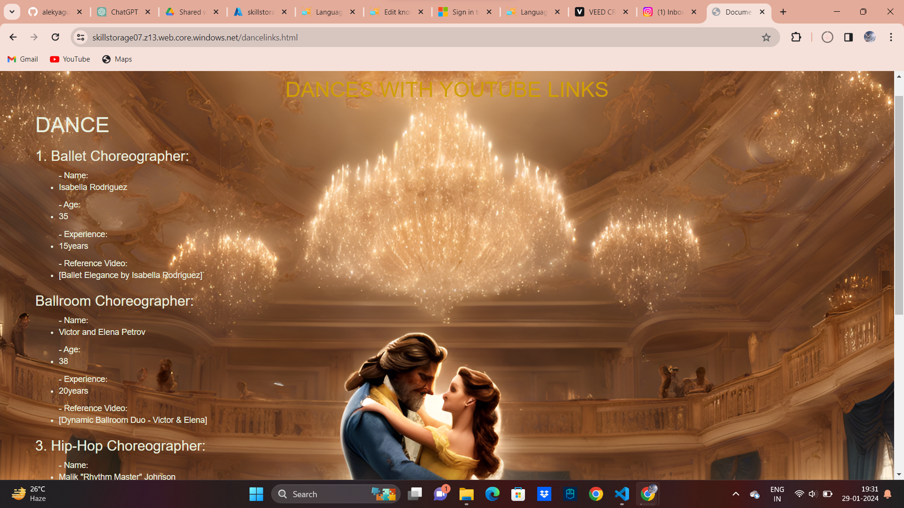

